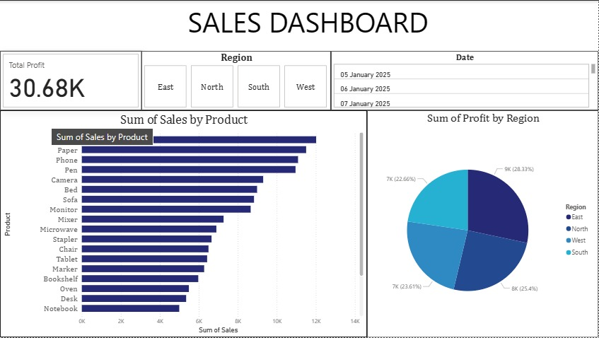

# 📊 Sales Data Dashboard

This project is a beginner-friendly **Sales Dashboard** created using **Excel** and **Power BI**. It demonstrates how to analyze sales data and build interactive dashboards with key performance indicators (KPIs).

---

## 📂 Dataset

- **File:** `sales_dashboard_sample.xlsx`
- **Source:** Retail sales data (mock dataset, can be replaced with real-world data from Excel/Kaggle).
- **Columns:**
  - `Date` – Transaction date
  - `Product` – Product name
  - `Region` – Sales region (East, West, North, South)
  - `Sales` – Sales revenue
  - `Profit` – Profit from sales
  - `Quantity` – Number of units sold

---

## 🎯 Project Goals

- Build KPIs:
  - ✅ **Total Sales**
  - ✅ **Top Products by Sales**
  - ✅ **Profit by Region**
- Create interactive dashboards in **Excel** and **Power BI**
- Learn key concepts: Pivot Tables, Charts, Slicers, and DAX Measures

---

## 🛠 Tools Used

- **Excel** (Pivot Tables, Pivot Charts, Slicers)
- **Power BI Desktop** (Data Modeling, DAX, Interactive Dashboard)

---

## 📈 Dashboard Features

### Excel Dashboard

- Pivot Tables for quick summaries
- KPI cards for **Total Sales** and **Profit**
- Charts for **Top Products** and **Profit by Region**
- Interactive filters with Slicers

### Power BI Dashboard

- KPI Cards for **Sales & Profit**
- **Bar Chart** for Top Products
- **Donut Chart** for Profit by Region
- **Slicers** for Region and Date

---

## 🚀 How to Use

1. Clone the repository:
   ```bash
   git clone https://github.com/SAKTHI7R/Sales Dashboard - PowerBi.git
   cd Sales Dashboard - PowerBi
   ```
2. Open `sales_dashboard_sample.xlsx` in Excel to view the pivot dashboard.
3. Open `sales_dashboard.pbix` in Power BI Desktop to explore the interactive version.

---

## 📸 Sample Dashboard Layout



---

## 📌 Learning Outcomes

- Understanding of **data cleaning and visualization** in Excel
- Hands-on practice with **Pivot Tables, Charts, and Slicers**
- Introduction to **Power BI** with measures, cards, and charts
- Building a **business-ready dashboard** for decision-making

---

✨ _This project is perfect for beginners in Data Analytics who want hands-on experience with Excel & Power BI._
