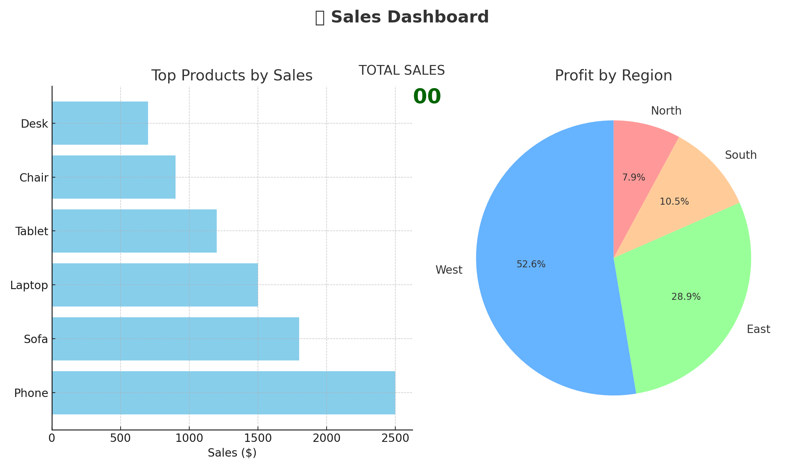

# 📊 Sales Data Dashboard

A clean and interactive **Sales Dashboard** built in **Microsoft Excel** to analyze retail sales performance using **PivotTables** and **Charts**.  

---

## 🚀 Features
- **KPI Overview** – Total Sales, Profit, and Quantity Sold  
- **Top Products by Sales** – Ranked bar chart for quick comparison  
- **Profit by Region** – Pie chart showing regional contribution  
- **Category-Wise Performance** – Filterable by product category  
- **Interactive Slicers** – Easily filter by **Region**, **Category**, and **Date**  
- **Dynamic Dashboard** – Automatically updates with new data  

---

## 🛠 Tools & Technologies
- **Microsoft Excel** (PivotTables, PivotCharts, Slicers, Conditional Formatting)  
 

---

## 📂 Dataset
Sample dataset: `sales_dashboard_sample.xlsx`  

**Columns included:**  
- `Order ID`  
- `Date`  
- `Product`  
- `Category`  
- `Quantity`  
- `Sales`  
- `Profit`  
- `Region`  

---

## 📸 Dashboard Preview
  

---

## 🔍 Key Insights
- **West Region** is the most profitable overall.  
- **Phones** drive the highest sales revenue.  
- **Furniture (Sofa & Chair)** shows strong contribution alongside Electronics.  
- Regional performance varies, highlighting potential areas for targeted strategy.  

---

## 📈 Future Enhancements
- 📌 Add **Year-over-Year comparison** (Sales & Profit trends).  
- 📌 Integrate **Customer Segment Analysis**.  
- 📌 Include **Forecasting & What-if analysis** using Excel/Power BI.  
- 📌 Build a **Power BI version** for richer interactivity and drill-through insights.  

---

## 📖 How to Use
1. Open `sales_dashboard_sample.xlsx` in **Microsoft Excel**.  
2. Navigate to the **Dashboard sheet**.  
3. Use slicers (Region, Category, Date) to filter data interactively.  
4. Refresh PivotTables (`Data > Refresh All`) when adding new sales data.  

---

💡 *This project demonstrates how Excel can be leveraged for interactive data analysis and visualization without advanced BI tools.*  
